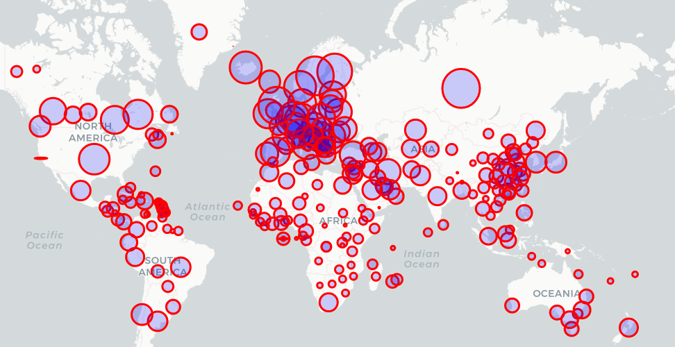

# COVID-19-Data-Analysis

Coronavirus disease 2019 (COVID-19) is an infectious disease caused by severe acute respiratory syndrome coronavirus 2 (SARS-CoV-2).
The disease was first identified in December 2019 in Wuhan, the capital of China's Hubei province, and has since spread globally, resulting in the ongoing 2019–20 coronavirus pandemic.
The first confirmed case of what was then an unknown coronavirus was traced back to November 2019 in Hubei province.Common symptoms include fever, cough, and shortness of breath.
Other symptoms may include fatigue, muscle pain, diarrhoea, sore throat, loss of smell, and abdominal pain.The time from exposure to onset of symptoms is typically around five days but may range from two to fourteen days.
While the majority of cases result in mild symptoms, some progress to viral pneumonia and multi-organ failure.
As of 23 April 2020, more than 2.62 million cases have been reported across 185 countries and territories,resulting in more than 183,000 deaths.More than 784,000 people have recovered.

<h4>Data</h4>
https://raw.githubusercontent.com/CSSEGISandData/COVID-19/master/csse_covid_19_data/csse_covid_19_time_series/time_series_covid19_deaths_global.csv
https://raw.githubusercontent.com/CSSEGISandData/COVID-19/master/csse_covid_19_data/csse_covid_19_time_series/time_series_covid19_confirmed_global.csv
https://raw.githubusercontent.com/CSSEGISandData/COVID-19/master/csse_covid_19_data/csse_covid_19_time_series/time_series_covid19_recovered_global.csv
https://raw.githubusercontent.com/CSSEGISandData/COVID-19/web-data/data/cases_country.csv

<h3>Implementing map with Folium<h3>

